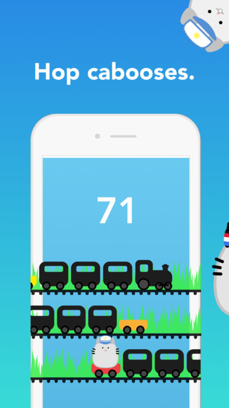

# PoosCabooseGame

Poos Caboose is an iOS game written in Swift that was featured by the App Store in 154 countries.

You start the game as an adorable cat we call Poos. To play, time your taps so that the next Caboose lines up with your
Poos. Each successful jump awards one point. At the end of each round, points turn into poos coin, which can be used to
purchase customized pooses. You can (optionally) login with Facebook to view how you line up against your friends & the rest
of the world.

You can download it on the [App Store](https://itunes.apple.com/us/app/poos-caboose-the-worlds-cutest-jumping-game/id1263697839?ls=1&mt=8) or check it out on [Product Hunt](https://www.producthunt.com/posts/poos-caboose).

Here's a [video demo](https://www.youtube.com/watch?v=WbRBwiLnNGU) of version 1.0. 

 
